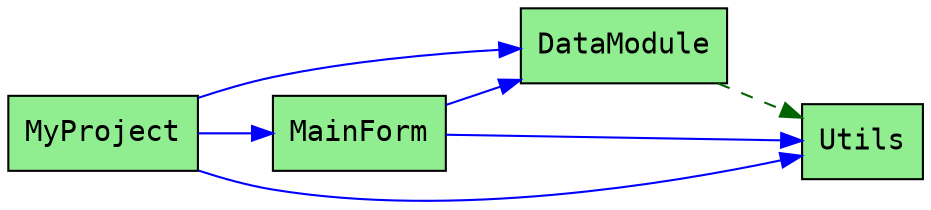

# DelphiUsesGraph

A command-line tool that generates Graphviz dependency graphs from Delphi projects. Visualize the `uses` clause relationships between units in your Delphi codebase.

## Features

- Parses `.dpr` project files and all referenced `.pas` units
- Extracts dependencies from both `interface` and `implementation` sections
- Generates DOT format output compatible with Graphviz
- Color-coded visualization distinguishing:
  - Project units vs RTL/VCL units
  - Interface dependencies vs implementation dependencies
- Handles all Delphi comment styles (`//`, `{ }`, `(* *)`)
- Preserves compiler directives (`{$...}`)

## Requirements

- Embarcadero Delphi (for building)
- [Graphviz](https://graphviz.org/) (for rendering graphs)

## Building

### Using Delphi IDE

1. Open `DelphiUsesGraph.dproj` in Delphi IDE
2. Build the project (F9 or Project > Build)

### Using MSBuild

```bash
msbuild DelphiUsesGraph.dproj /p:Config=Release
```

## Usage

```
DelphiUsesGraph <project_file.dpr> [output_file] [options]
```

### Arguments

| Argument | Description |
|----------|-------------|
| `project_file.dpr` | Path to Delphi project file (required) |
| `output_file` | Output .dot file (default: `uses_graph.dot`) |

### Options

| Option | Description |
|--------|-------------|
| `-rtl` | Include RTL/VCL units in the graph |
| `-h, --help` | Show help message |

### Examples

Generate a dependency graph for your project:
```bash
DelphiUsesGraph MyProject.dpr
```

Specify a custom output file:
```bash
DelphiUsesGraph MyProject.dpr dependencies.dot
```

Include RTL/VCL units in the graph:
```bash
DelphiUsesGraph MyProject.dpr output.dot -rtl
```

## Rendering the Graph

After generating the `.dot` file, use Graphviz to render it:

```bash
# Generate PNG image
dot -Tpng uses_graph.dot -o uses_graph.png

# Generate SVG (scalable, good for large graphs)
dot -Tsvg uses_graph.dot -o uses_graph.svg

# Generate PDF
dot -Tpdf uses_graph.dot -o uses_graph.pdf
```

You can also use online viewers like [GraphvizOnline](https://dreampuf.github.io/GraphvizOnline/) or [Edotor](https://edotor.net/).

## Graph Legend

### Node Colors

| Color | Meaning |
|-------|---------|
| Light Green | Project unit (part of your codebase) |
| Light Blue | RTL/VCL unit (only shown with `-rtl` flag) |

### Edge Styles

| Style | Color | Meaning |
|-------|-------|---------|
| Solid | Blue | Interface `uses` (project unit) |
| Solid | Gray | Interface `uses` (RTL unit) |
| Dashed | Dark Green | Implementation `uses` (project unit) |
| Dashed | Light Gray | Implementation `uses` (RTL unit) |

## Example Output

For a project with the following structure:

```
MyProject.dpr
  uses
    MainForm in 'MainForm.pas',
    DataModule in 'DataModule.pas',
    Utils in 'Utils.pas';
```

Where `MainForm` uses `DataModule` and `Utils` in its interface section, and `DataModule` uses `Utils` in its implementation section, the tool generates:



## How It Works

1. Parses the `.dpr` project file to find all units with `in 'path'` references
2. For each unit, strips comments while preserving strings and compiler directives
3. Extracts the unit name from `unit` or `program` declaration
4. Parses `uses` clauses from both `interface` and `implementation` sections
5. Generates a DOT graph with edges representing dependencies

## Limitations

- Only analyzes units explicitly referenced in the `.dpr` file with `in 'path'` syntax
- Does not follow transitive dependencies to units outside the project
- Does not parse `.dpk` (package) or `.dproj` files directly

## License

MIT License - See [LICENSE](LICENSE) for details.
